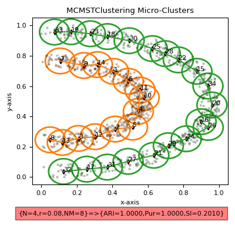
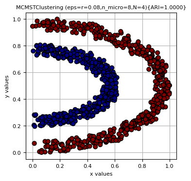
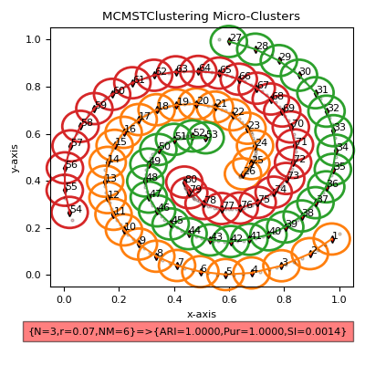
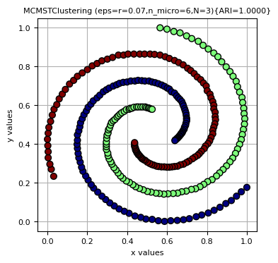
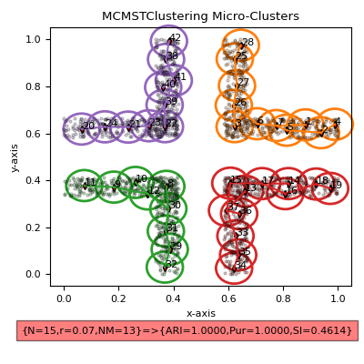
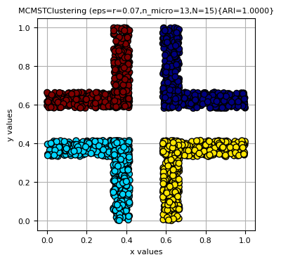
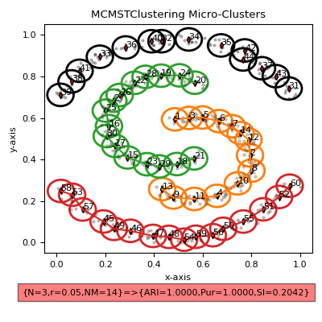
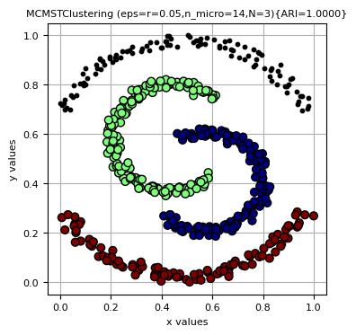

# MCMSTClustering
Python Implementation of MCMSTClustering

In this study, we proposed a novel clustering algorithm named as MCMSTClustering (Defining Non-Spherical Clusters by using Minimum Spanning Tree over KD-Tree-based Micro-Clusters) to overcome problems related to clustering algorithms are handling high-dimensional, imbalanced, and/or varying-density datasets, detecting outliers, and defining arbitrary-shaped clusters simultaneously. Our algorithm consists of three parts. The first part is defining microclusters using the KD-Tree data structure with range search. The second part is constructing macro-clusters by using minimum spanning tree (MST) on defined micro-clusters, and the final part is regulating defined clusters to increase theaccuracy of the algorithm. To state the efficiency of our algorithm, we performed some experimental studies on some state-ofthe-art algorithms. The findings were presented in detail with tables and graphs. The success of the proposed algorithm using various performance evaluation criteria was confirmed. According to the experimental studies, MCMSTClustering outperformed competitor algorithms in aspects of clustering quality in acceptable run-time.

The main contributions of our algorithm can be summed up as follows:

• It clusters datasets with high-quality,

• It can detect arbitrary-shaped clusters,

• It can overcome outliers/noisy data,

• It can handle clusters that have varying densities,

• It is efficient on imbalanced datasets.

 

 

 

 

If you use the code in your works, please cite the paper given below:

<b>Cite this article:</b>

Şenol, A. MCMSTClustering: defining non-spherical clusters by using minimum spanning tree over KD-tree-based micro-clusters. Neural Comput & Applic (2023). https://doi.org/10.1007/s00521-023-08386-3

